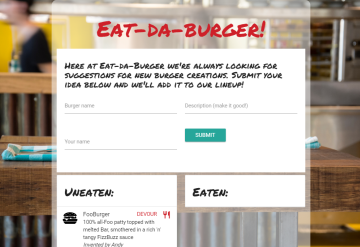

# sequelizeburger

:hamburger: The "Eat-Da-Burger" burger joint has run out of good ideas! Now they're crowdsourcing burger creation, and it's up to the user to invent new burgers.

A Node app with MySQL database, connected via the [sequelize](http://docs.sequelizejs.com/) ORM, which defines and associates two models, "burger" and "inventor." The UI uses the [Materialize](http://materializecss.com/) framework and [handlebars](http://handlebarsjs.com/) templating.

---
Built September 7, 2017 by Andy Bonner as a project for the UNC Coding Bootcamp
